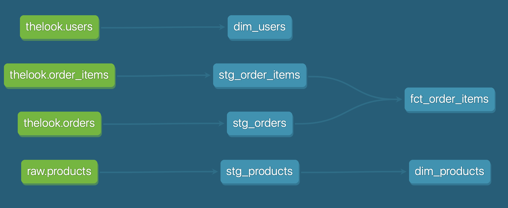

# E-commerce Analytics Pipeline

An end-to-end analytics engineering project that transforms raw e-commerce data into a tested, documented dimensional model using **dbt** on **Google BigQuery**. Built to demonstrate modern ELT practices: layered modeling, data-quality testing as code, source-to-mart lineage, and a reproducible development environment.

> **Note:** This project uses the public `thelook_ecommerce` dataset as its source. The same patterns apply to any raw source — see [Roadmap](#roadmap) for the planned API-ingestion layer.

---

## Architecture

Raw source data is transformed through two dbt layers — **staging** (light cleaning, materialized as views) and **marts** (a dimensional model, materialized as tables) — with data-quality tests enforced at each stage.

```
bigquery-public-data.thelook_ecommerce   ──►   staging (views)   ──►   marts (tables)
        orders, order_items, users              stg_orders              dim_users
                                                 stg_order_items         fct_order_items
```



---

## Tech Stack

| Layer | Tool |
|---|---|
| Transformation | dbt Core |
| Data warehouse | Google BigQuery |
| Environment / dependencies | uv (Python 3.12) |
| Version control | Git / GitHub |

---

## Data Model

The project follows a **star schema** built through clean, dependency-managed layers:

**Sources** — raw tables declared in `models/staging/_sources.yml`, referenced everywhere via dbt's `source()` function so raw table paths are never hardcoded.

**Staging** (`models/staging/`, materialized as **views**) — one model per source table, handling renaming and type casting only. No joins.
- `stg_orders` — one row per order
- `stg_order_items` — one row per order line item

**Marts** (`models/marts/`, materialized as **tables**) — the dimensional model, joined via `ref()` so dbt resolves build order automatically.
- `dim_users` — user dimension (one row per user)
- `fct_order_items` — order-item fact table, with order status and timing

---

## Data Quality

Data quality is enforced as code and verified on every run. The project includes **9 data tests**:

- **Uniqueness & not-null** on every primary key (`order_id`, `order_item_id`, `user_id`)
- **Referential integrity** — a `relationships` test confirming every `user_id` in `fct_order_items` exists in `dim_users`, so there are no orphaned records

Run them with `dbt test`; all currently pass.

---

## Getting Started

### Prerequisites
- A Google Cloud project with **BigQuery** enabled (the free Sandbox is sufficient — no billing required)
- [`uv`](https://docs.astral.sh/uv/) installed
- [Google Cloud CLI](https://cloud.google.com/sdk/docs/install) (`gcloud`) installed

### Setup

```bash
# 1. Clone and enter the project
git clone https://github.com/zoekoppe/ecommerce-analytics-pipeline.git
cd ecommerce-analytics-pipeline

# 2. Install dependencies into a managed environment
uv sync

# 3. Authenticate to BigQuery (opens a browser)
gcloud auth application-default login
gcloud config set project dbt-bigquery-portfolio
```

Configure your `~/.dbt/profiles.yml` connection:

```yaml
analytics:
  target: dev
  outputs:
    dev:
      type: bigquery
      method: oauth
      project: dbt-bigquery-portfolio
      dataset: dbt_dev
      location: US
      threads: 4
      maximum_bytes_billed: 100000000000   # ~100 GB scan safety cap
```

### Run

```bash
cd analytics
uv run dbt deps        # install packages (dbt_utils)
uv run dbt run         # build all models into BigQuery
uv run dbt test        # run all data-quality tests
uv run dbt docs generate && uv run dbt docs serve   # view the lineage graph
```

---

## Project Structure

```
analytics/
├── dbt_project.yml
├── packages.yml
└── models/
    ├── staging/
    │   ├── _sources.yml        # raw source declarations
    │   ├── _staging.yml        # staging tests + docs
    │   ├── stg_orders.sql
    │   └── stg_order_items.sql
    └── marts/
        ├── _marts.yml          # marts tests + docs
        ├── dim_users.sql
        └── fct_order_items.sql
```

---

## Roadmap

Planned enhancements to extend this from a transformation project into a full pipeline:

- **Python ingestion layer** — replace the in-place public dataset with a script that pulls from a live API and loads into a raw BigQuery dataset, demonstrating the extract-and-load half of ELT.
- **Orchestration with Prefect** — schedule the full `ingest → dbt run → dbt test` sequence as a flow, with automated alerting on failures.
- **Incremental models** — convert `fct_order_items` to an incremental materialization to process only new records.
- **Additional marts** — revenue and customer-behavior models built on the existing dimensional layer.

---

## Author

**Zoe Koppenhofer** — https://www.linkedin.com/in/zoë-koppenhofer-25493611a/ · zkoppenhofer@gmail.com