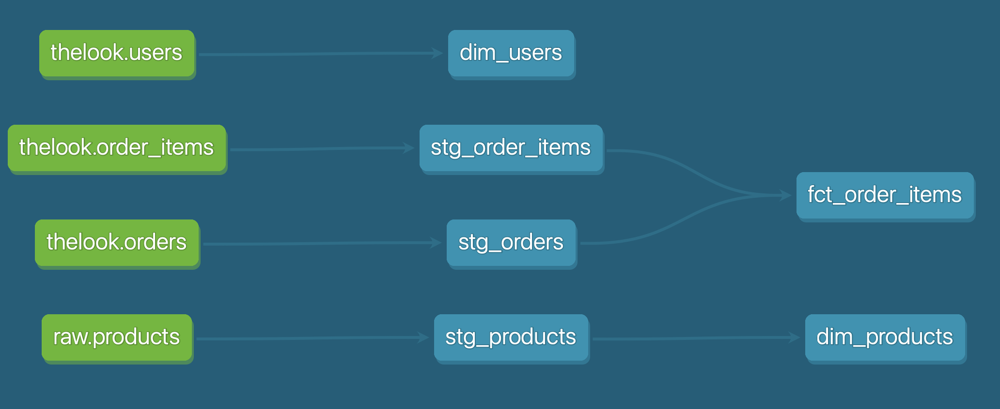

# E-commerce Analytics Pipeline

A full ELT pipeline that grabs e-commerce data from a live API, drops it into **Google BigQuery**, transforms it into a clean, tested dimensional model with **dbt**, and ties the whole thing together with a **Prefect** flow. I built it to show the full workflow end to end: pulling data in with Python, modeling it in layers, testing it as code, orchestrating the steps, and keeping everything reproducible.

---

## How it fits together

Two e-commerce data sources flow through the same dbt layers — **staging** (light cleanup, built as views) and **marts** (the dimensional model, built as tables) — with tests along the way.

```
DummyJSON API  ──►  raw.products  ──►  stg_products  ──►  dim_products
   (Python EL)       (append-only)      (dedup to latest)

bigquery-public-data.thelook_ecommerce  ──►  staging (views)  ──►  marts (tables)
        orders, order_items, users             stg_orders           dim_users
                                                stg_order_items      fct_order_items (incremental)
```

A single Prefect flow runs the whole thing in order:

```
ingest_products  ──►  dbt run  ──►  dbt test
   (retries)          (build)      (quality gate)
```

### Why two sources?

Two on purpose — I wanted to show both sides of a real data platform:

- **`thelook_ecommerce`** (a public BigQuery dataset) is the transactional core: realistic orders, order items, and users. It's already sitting in the warehouse, so it's the "data's already here, now model it well" situation — which let me spend my time on the modeling instead of building ingestion for every single table.

- **DummyJSON** (a live REST API) covers the part a ready-made dataset just can't: actually *getting data in*. So I pull the product catalog straight from the API and load it into the warehouse myself. I went with products because that's the one dimension the orders and users were missing — so it fills a gap instead of dragging in some random unrelated dataset.

The two don't share keys, so they're modeled separately — that's on purpose, just to keep each piece clean. There's a note in the [roadmap](#roadmap) on how pulling in DummyJSON carts would tie the products back to actual orders.




---

## What I used

| Layer | Tool |
|---|---|
| Ingestion (extract + load) | Python (requests, google-cloud-bigquery) |
| Data warehouse | Google BigQuery |
| Transformation | dbt Core |
| Orchestration | Prefect |
| Environment / dependencies | uv (Python 3.12) |
| Version control | Git / GitHub |

---

## The data model

It's a **star schema**, built up in layers so each piece has just one job:

**Sources** — declared in `models/staging/_sources.yml`: the public `thelook_ecommerce` tables plus my own `raw.products` table from the ingestion script. Everything goes through dbt's `source()` function, so raw table paths never end up hardcoded in the SQL.

**Staging** (`models/staging/`, built as **views**) — one model per source table, just renaming and fixing types. No joins here.
- `stg_orders` — one row per order
- `stg_order_items` — one row per order line item
- `stg_products` — one row per product (the latest version from the append-only raw table)

**Marts** (`models/marts/`, built as **tables**) — the dimensional model, wired together with `ref()` so dbt figures out the build order itself.
- `dim_users` — one row per user
- `dim_products` — one row per product (from the ingested catalog)
- `fct_order_items` — the order-item fact table, with order status and timing (built **incrementally**, see below)

---

## Incremental loading

Rebuilding every table from scratch on every run is simple, but the cost grows with the total size of the data. Incremental loading only processes what's **new or changed** since the last run. This project does it at both ends:

- **Ingestion:** products are appended to an append-only raw table and deduped in staging (see [Append, then dedup](#append-then-dedup)).
- **Fact table:** `fct_order_items` is a dbt `incremental` model that merges in only recent orders.

### How `fct_order_items` works

```sql
{{ config(materialized='incremental', incremental_strategy='merge', unique_key='order_item_id') }}
...

WHERE created_at >= (
    SELECT TIMESTAMP_SUB(MAX(created_at), INTERVAL {{ var('incremental_lookback_days', 3) }} DAY)
    FROM {{ this }}
)

```

- **First run** (or `--full-refresh`): the table doesn't exist yet, so `is_incremental()` is false and dbt builds the whole table (`CREATE TABLE`).
- **Later runs:** `is_incremental()` is true, so only orders near or after the newest `created_at` already in the table (`{{ this }}`) are processed.
- **`merge` on `order_item_id`:** dbt writes with a BigQuery `MERGE`: rows that already exist are updated, new ones are inserted. So re-processing a row never creates a duplicate, and the `unique` test on `order_item_id` checks that.
- **Lookback window** (`incremental_lookback_days`, default 3 days): orders change status after they're created (processing → shipped → delivered), but `created_at` never changes. Re-processing the last few days picks up those recent status changes.

**The trade-off:** a status change older than the lookback window (say, a return a month later) is missed. That's what a **full refresh** is for: it rebuilds the table from scratch, so run one now and then.

```bash
cd analytics
uv run dbt run --select fct_order_items                                     # incremental (MERGE)
uv run dbt run --select fct_order_items --vars '{incremental_lookback_days: 7}'
uv run dbt run --select fct_order_items --full-refresh                      # rebuild (CREATE TABLE)
```

> **Needs billing enabled.** `MERGE` is a DML statement, and the BigQuery Sandbox doesn't allow DML, so incremental runs fail there. With billing on, this project still fits comfortably in BigQuery's free tier (1 TiB of queries and 10 GiB of storage per month).

---

## Ingestion

`src/ingest_products.py` does the extract-and-load bit:

- **Extract** — grabs the whole product catalog from the DummyJSON API in one request
- **Transform** — flattens each product into a flat row and keeps the fields worth keeping
- **Load** — spins up the `raw` dataset/table if it's not there yet (with an explicit schema, so types are locked in rather than guessed) and **appends** the rows as a new batch, tagging each with an `ingested_at` time

It's split into tidy extract / transform / load functions, so the same skeleton works against pretty much any API — you just swap the URL and the field mapping.

### Append, then dedup

Each run **appends** the whole catalog to `raw.products` (`WRITE_APPEND`) instead of overwriting it. That makes the raw table an append-only history — one batch per run, all sharing the same `ingested_at` — so:

- a bad API response can't wipe out good data that's already loaded, and
- every past snapshot is kept, so price and stock changes can be tracked over time later.

The trade-off is that the same `product_id` now shows up once per run. Cleaning that up is dbt's job: `stg_products` keeps only the newest version of each product with a window function.

```sql
QUALIFY ROW_NUMBER() OVER (PARTITION BY product_id ORDER BY ingested_at DESC) = 1
```

`ROW_NUMBER()` numbers each product's versions from newest (1) to oldest, and `QUALIFY` keeps just row 1. The `unique` test on `stg_products.product_id` is the guard: if the dedup ever breaks, the build fails.

---

## Orchestration

`src/pipeline.py` is a Prefect flow that runs the whole pipeline — `ingest → dbt run → dbt test` — as one sequence:

- Each step is a Prefect **task**, composed into a **flow**
- The ingestion task has **retries**, so a flaky network call doesn't kill the run
- Steps run **in order**, so dbt never builds on missing data — and if the tests fail, that stops the run (a quality gate)
- A **failure hook** is wired in for alerting (I use Prefect Automations for email alerts)
- A **`full_refresh`** flow parameter passes `--full-refresh` to `dbt run`, rebuilding the incremental models from scratch

It runs on demand with a single command, and there's a daily schedule defined in the file that you can switch on with `serve` when you want it running unattended.

---

## Keeping the data honest

The tests live in the code and run on every build — **11** of them:

- **Unique + not-null** on every primary key (`order_id`, `order_item_id`, `user_id`, `product_id`) — on `stg_products` this also proves the dedup works, since the raw table holds one copy of each product per run
- **Referential integrity** — a `relationships` test that checks every `user_id` in `fct_order_items` actually exists in `dim_users`, so nothing's left orphaned

Run `dbt test` (or the flow) to see them — all green right now.

---

## Try it yourself

### You'll need
- A Google Cloud project with **BigQuery** on and **billing enabled**. The incremental model writes with `MERGE`, which the free Sandbox blocks. The project still fits in BigQuery's free tier, so set a small budget alert (Billing → Budgets & alerts) as a safety net.
  - If you're upgrading an existing Sandbox project, remove its 60-day table expiration too, or your tables (including the raw product history) will be deleted:
    ```sql
    ALTER SCHEMA `your-project.raw`     SET OPTIONS (default_table_expiration_days = NULL);
    ALTER SCHEMA `your-project.dbt_dev` SET OPTIONS (default_table_expiration_days = NULL);
    ALTER TABLE  `your-project.raw.products` SET OPTIONS (expiration_timestamp = NULL);
    ```
- [`uv`](https://docs.astral.sh/uv/) installed
- The [Google Cloud CLI](https://cloud.google.com/sdk/docs/install) (`gcloud`) installed

### Setup

```bash
# 1. Grab the project
git clone https://github.com/zoekoppe/ecommerce-analytics-pipeline.git
cd ecommerce-analytics-pipeline

# 2. Install everything into a managed environment
uv sync

# 3. Connect to BigQuery (opens a browser)
gcloud auth application-default login
gcloud config set project dbt-bigquery-portfolio
```

Then point `~/.dbt/profiles.yml` at your project:

```yaml
analytics:
  target: dev
  outputs:
    dev:
      type: bigquery
      method: oauth
      project: dbt-bigquery-portfolio
      dataset: dbt_dev
      location: US
      threads: 4
      maximum_bytes_billed: 100000000000   # ~100 GB scan safety cap
```

### Run it

The whole pipeline, in one command (ingest → build → test), orchestrated by Prefect:

```bash
uv run python src/pipeline.py
```

Prefer to run the steps yourself?

```bash
uv run python src/ingest_products.py     # append a new batch to raw.products
cd analytics
uv run dbt deps                           # install packages (dbt_utils)
uv run dbt run                            # build the models (fct_order_items incrementally)
uv run dbt test                           # run the tests
uv run dbt docs generate && uv run dbt docs serve   # see the lineage graph
```

Want the Prefect UI (flow runs, task timeline, logs)? Start it in another terminal:

```bash
uv run prefect server start               # UI at http://localhost:4200
```

To rebuild the incremental models from scratch as part of the flow:

```bash
uv run python src/pipeline.py full-refresh
```

And to run it on a schedule (daily, unattended) instead of on demand:

```bash
uv run python src/pipeline.py serve       # leave running; fires on the cron in the file
```

---

## What's where

```
.
├── src/
│   ├── ingest_products.py      # API → raw BigQuery ingestion (append)
│   └── pipeline.py             # Prefect flow: ingest → run → test (optional full refresh)
└── analytics/
    ├── dbt_project.yml
    ├── packages.yml
    └── models/
        ├── staging/
        │   ├── _sources.yml    # raw source declarations
        │   ├── _staging.yml    # staging tests + docs
        │   ├── stg_orders.sql
        │   ├── stg_order_items.sql
        │   └── stg_products.sql   # dedups to the latest version
        └── marts/
            ├── _marts.yml      # marts tests + docs
            ├── dim_users.sql
            ├── dim_products.sql
            └── fct_order_items.sql   # incremental (merge)
```

---

## Roadmap

Where this is headed next:

- ~~**Incremental models**~~ — ✅ done: append-only product ingestion with dedup in staging, and an incremental `fct_order_items` (see [Incremental loading](#incremental-loading)).
- **Product history (SCD Type 2)** — the append-only `raw.products` already keeps every snapshot, so a dbt snapshot could track how prices and stock change over time.
- **Ingest carts** — pull DummyJSON carts (they reference product IDs) to build an order fact that joins to `dim_products`.
- **Deploy the schedule** — run the Prefect flow unattended on a real work pool instead of on demand.
- **More marts** — revenue and customer-behavior models on top of what's already here.

---

## Author

**Zoe Koppenhofer** — https://www.linkedin.com/in/zoë-koppenhofer-25493611a/ · zkoppenhofer@gmail.com